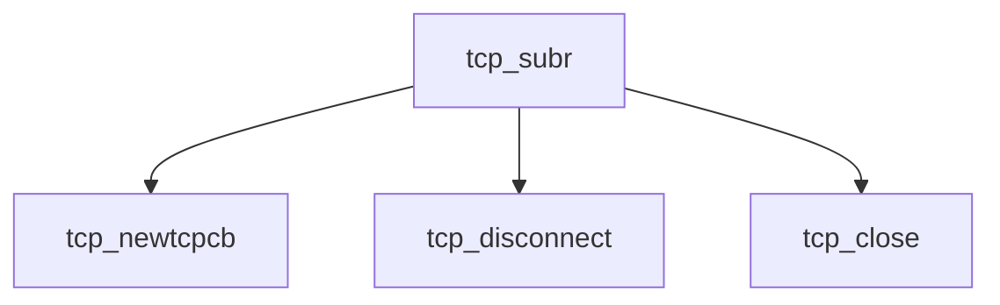

# Component: tcp_subr.c

**Path:** `sys/netinet/tcp_subr.c`
**Type:** File
**Maps to:** `.discovery/sys/netinet/tcp_subr.md`

## Purpose

TCP subroutines - TCP protocol support functions.

## Structure

## Key Functions

| Function | Purpose | Signature |
|----------|---------|-----------|
| `tcp_newtcpcb` | New TCB | `struct tcpcb *tcp_newtcpcb(struct inpcb *inp)` |
| `tcp_disconnect` | Disconnect | `int tcp_disconnect(struct tcpcb *tp)` |
| `tcp_close` | Close | `void tcp_close(struct tcpcb *tp)` |

## Use Cases

| Use | Description |
|-----|-------------|
| `tcp` | TCP protocol |
| `subr` | Support functions |

## Includes

- `netinet/tcp_var.h` - TCP variables