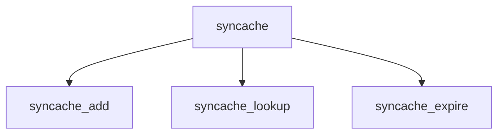

# Component: tcp_syncache.c

**Path:** `sys/netinet/tcp_syncache.c`
**Type:** File
**Maps to:** `.discovery/sys/netinet/tcp_syncache.md`

## Purpose

TCP syncache - SYN cookie and incomplete connection state cache.

## Structure

## Key Functions

| Function | Purpose | Signature |
|----------|---------|-----------|
| `syncache_add` | Add | `int syncache_add(struct inpcb *inp, ...)` |
| `syncache_lookup` | Lookup | `struct syncache *syncache_lookup(...)` |
| `syncache_expire` | Expire | `void syncache_expire(void)` |

## Use Cases

| Use | Description |
|-----|-------------|
| `tcp` | TCP protocol |
| `syncache` | SYN cache |
| `syncookie` | SYN cookies |

## Includes

- `netinet/tcp_var.h` - TCP variables