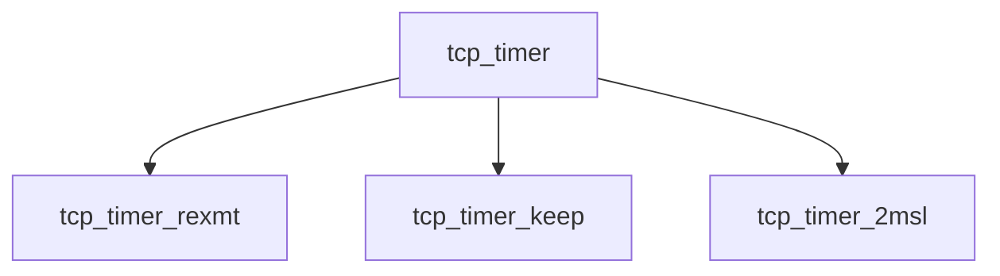

# Component: tcp_timer.c

**Path:** `sys/netinet/tcp_timer.c`
**Type:** File
**Maps to:** `.discovery/sys/netinet/tcp_timer.md`

## Purpose

TCP timer - TCP protocol timer management.

## Structure

## Key Functions

| Function | Purpose | Signature |
|----------|---------|-----------|
| `tcp_timer_rexmt` | Retransmit | `void tcp_timer_rexmt(struct tcpcb *tp)` |
| `tcp_timer_keep` | Keepalive | `void tcp_timer_keep(struct tcpcb *tp)` |
| `tcp_timer_2msl` | 2MSL | `void tcp_timer_2msl(struct tcpcb *tp)` |

## Use Cases

| Use | Description |
|-----|-------------|
| `tcp` | TCP protocol |
| `timer` | Timer management |

## Includes

- `netinet/tcp_var.h` - TCP variables