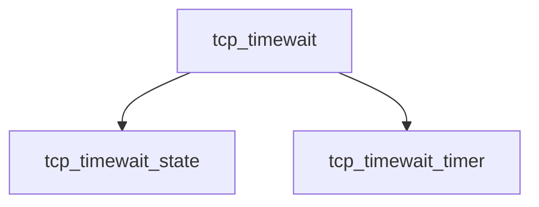

# Component: tcp_timewait.c

**Path:** `sys/netinet/tcp_timewait.c`
**Type:** File
**Maps to:** `.discovery/sys/netinet/tcp_timewait.md`

## Purpose

TCP timewait - TCP TIME_WAIT state management.

## Structure

## Key Functions

| Function | Purpose | Signature |
|----------|---------|-----------|
| `tcp_timewait_state` | State | `void tcp_timewait_state(struct tcpcb *tp)` |
| `tcp_timewait_timer` | Timer | `void tcp_timewait_timer(struct tcpcb *tp)` |

## Use Cases

| Use | Description |
|-----|-------------|
| `tcp` | TCP protocol |
| `timewait` | TIME_WAIT state |

## Includes

- `netinet/tcp_var.h` - TCP variables