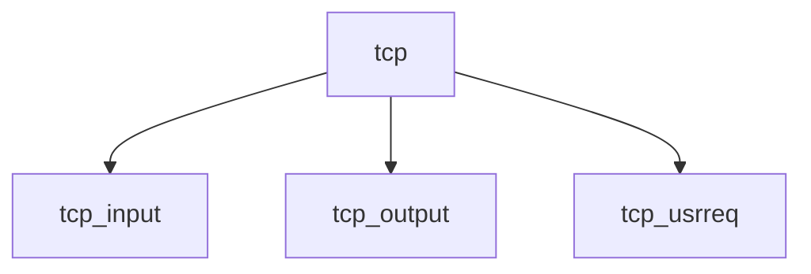

# Component: tcp_usrreq.c

**Path:** `sys/netinet/tcp_usrreq.c`
**Type:** File
**Maps to:** `.discovery/sys/netinet/tcp_usrreq.md`

## Purpose

TCP user requests - TCP protocol user request handlers.

## Structure

## Key Functions

| Function | Purpose | Signature |
|----------|---------|-----------|
| `tcp_input` | Input | `void tcp_input(struct mbuf *m, int off)` |
| `tcp_output` | Output | `int tcp_output(struct tcpcb *tp)` |
| `tcp_usrreq` | User req | `int tcp_usrreq(struct socket *so, int req, ...)` |

## Use Cases

| Use | Description |
|-----|-------------|
| `tcp` | TCP protocol |
| `socket` | Socket operations |

## Includes

- `netinet/tcp.h` - TCP definitions