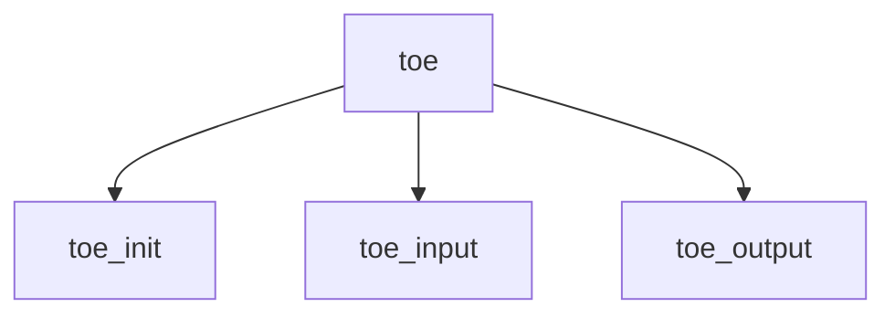

# Component: toecore.c

**Path:** `sys/netinet/toecore.c`
**Type:** File
**Maps to:** `.discovery/sys/netinet/toecore.md`

## Purpose

TCP Offload Engine - TOE functionality for Chelsio adapters.

## Structure

## Key Functions

| Function | Purpose | Signature |
|----------|---------|-----------|
| `toe_init` | Init | `int toe_init(void)` |
| `toe_input` | Input | `void toe_input(struct mbuf *m, ...)` |
| `toe_output` | Output | `int toe_output(struct ifnet *ifp, ...)` |

## Use Cases

| Use | Description |
|-----|-------------|
| `toe` | TCP Offload Engine |
| `offload` | Hardware offload |

## Includes

- `netinet/tcp_var.h` - TCP variables