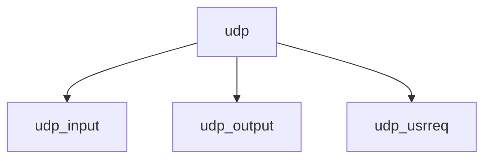

# Component: udp_usrreq.c

**Path:** `sys/netinet/udp_usrreq.c`
**Type:** File
**Maps to:** `.discovery/sys/netinet/udp_usrreq.md`

## Purpose

UDP user requests - UDP protocol user request handlers.

## Structure

## Key Functions

| Function | Purpose | Signature |
|----------|---------|-----------|
| `udp_input` | Input | `void udp_input(struct mbuf *m, int off)` |
| `udp_output` | Output | `int udp_output(struct inpcb *inp, struct mbuf *m, ...)` |
| `udp_usrreq` | User req | `int udp_usrreq(struct socket *so, int req, ...)` |

## Use Cases

| Use | Description |
|-----|-------------|
| `udp` | UDP protocol |
| `socket` | Socket operations |

## Includes

- `netinet/udp.h` - UDP definitions