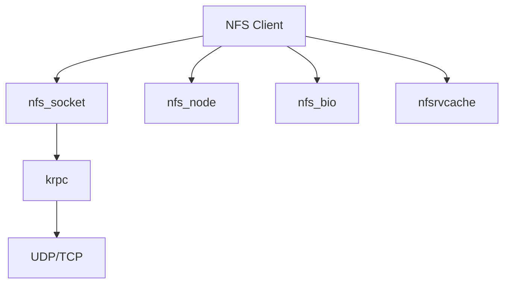

# sys/nfsclient/ — NFS Client Codebase Map

**Path:** `sys/nfsclient/`
**Purpose:** NFS version 2/3 client implementation

## Overview

The nfsclient directory contains the NFS client kernel code for NFSv2 and NFSv3.

## Key Files

| File | Purpose |
|------|---------|
| `nfs_krpc.c` | Krpc for NFS |
| `nfs_node.c` | NFS vnode ops |
| `nfs_socket.c` | NFS socket ops |
| `nfs_bio.c` | NFS I/O |
| `nfs_subs.c` | NFS subroutines |
| `nfsrvcache.c` | Reply cache |

## NFS Client Structure

## Relationships

- `nfs_bio.c` → handles VOP operations
- `nfs_socket.c` → socket communication
- `nfsrvcache.c` → reply cache for duplicate requests

## See Also

- `sys/nfs/` - NFS shared
- `sys/nfsserver/` - NFS server