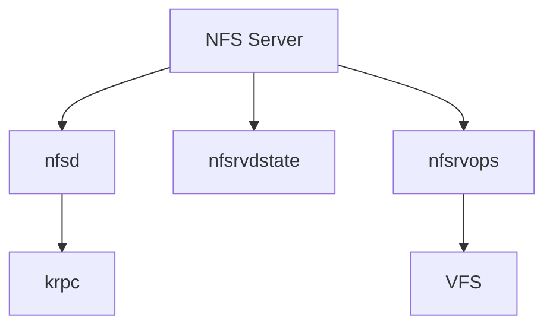

# sys/nfsserver/ — NFS Server Codebase Map

**Path:** `sys/nfsserver/`
**Purpose:** NFS version 2/3/4 server implementation

## Overview

The nfsserver directory contains the NFS server kernel code.

## Key Files

| File | Purpose |
|------|---------|
| `nfsd.c` | Main NFS daemon |
| `nfsdstate.c` | State management |
| `nfsd顶峰.c` | Export operations |
| `nfsrvdirops.c` | Directory operations |
| `nfsrvops.c` | VFS operations |
| `nfsm_subs.c` | NFS macros |

## NFS Server Structure



## VFS Operations

```c
static struct vop_vector nfsd_vnodeops = {
    .vop_default_fn =     nfsd_vop_default,
    .vop_access =         nfsd_access,
    .vop_advlock =        nfsd_advlock,
    .vop_close =          nfsd_close,
    .vop_create =         nfsd_create,
    .vop_getattr =        nfsd_getattr,
    .vop_inactive =       nfsd_inactive,
    .vop_lookup =         nfsd_lookup,
    .vop_open =           nfsd_open,
    .vop_pathconf =       nfsd_pathconf,
    .vop_read =           nfsd_read,
    .vop_readdir =        nfsd_readdir,
    .vop_readlink =       nfsd_readlink,
    .vop_remove =         nfsd_remove,
    .vop_rename =         nfsd_rename,
    .vop_revoke =         nfsd_revoke,
    .vop_setattr =        nfsd_setattr,
    .vop_strategy =       nfsd_strategy,
    .vop_write =          nfsd_write,
};
```

## See Also

- `sys/nfs/` - NFS shared
- `sys/nfsclient/` - NFS client