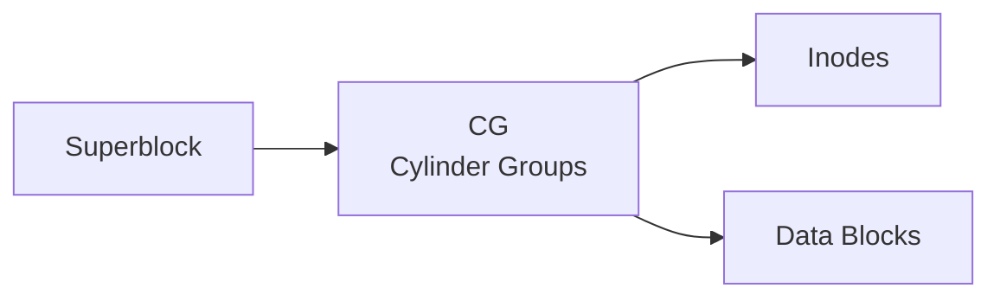

# sys/ufs/ — UFS Filesystem Codebase Map

**Path:** `sys/ufs/`
**Purpose:** UFS (Unix Filesystem) implementation

## Overview

The ufs directory contains the UFS filesystem code (FFS, UFS1, UFS2).

## Key Directories

| Directory | Purpose |
|-----------|---------|
| `ufs/` | Core UFS |
| `ffs/` | Fast Filesystem |
| `ufs1/` | UFS1 specific |
| `ufs2/` | UFS2 specific |

## Key Files

| File | Purpose |
|------|---------|
| `ufs/ufs_vnops.c` | UFS VFS ops |
| `ffs/ffs_vfsops.c` | FFS VFS ops |
| `ffs/ffs_vnops.c` | FFS vnode ops |
| `ffs/ffs_frag.c` | Fragment handling |
| `ffs/ffs_alloc.c` | Block allocation |
| `ffs/ffs_inode.c` | Inode ops |
| `ufs1/ufs_odsect.c` | UFS1 dir |
| `ufs2/ufs_odsect.c` | UFS2 dir |

## On-Disk Structure

## FFS Features

- Soft updates (SU)
- Journaled UFS (UFS+J)
- Extent-based allocation
- File system Checkpointing

## See Also

- `sys/fs/` - Generic filesystem