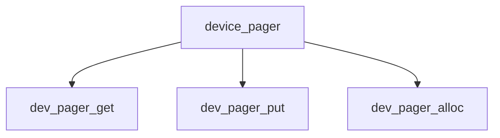

# Component: device_pager.c

**Path:** `sys/vm/device_pager.c`
**Type:** File
**Maps to:** `.discovery/sys/vm/device_pager.md`

## Purpose

Device pager - pager for device-backed VM objects.

## Structure

## Key Functions

| Function | Purpose | Signature |
|----------|---------|-----------|
| `dev_pager_get` | Get pages | `int dev_pager_get(void *handle, vm_page_t *pages, int count)` |
| `dev_pager_put` | Put pages | `int dev_pager_put(void *handle, vm_page_t *pages, int count)` |
| `dev_pager_alloc` | Allocate | `vm_object_t dev_pager_alloc(void *handle, vm_ooffset_t size, vm_prot_t prot)` |

## Use Cases

| Use | Description |
|-----|-------------|
| `device` | Device pager |
| `mmap` | Memory map |

## Includes

- `vm/device_pager.h` - Device pager definitions