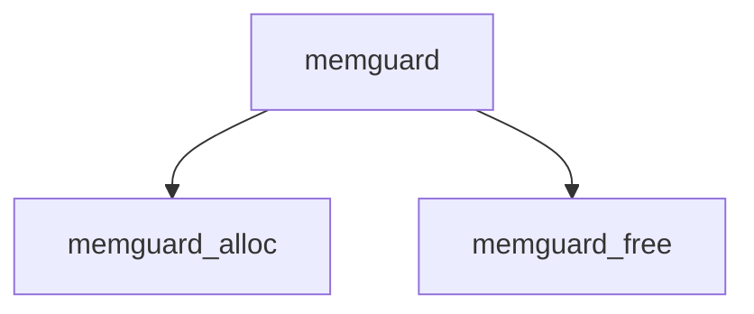

# Component: memguard.c

**Path:** `sys/vm/memguard.c`
**Type:** File
**Maps to:** `.discovery/sys/vm/memguard.md`

## Purpose

MemGuard - debugging memory allocator that provides ElectricFence-style protection.

## Structure

## Key Functions

| Function | Purpose | Signature |
|----------|---------|-----------|
| `memguard_alloc` | Allocate | `void *memguard_alloc(struct malloc_type *type, size_t size, int flags)` |
| `memguard_free` | Free | `void memguard_free(void *addr, size_t size)` |

## Use Cases

| Use | Description |
|-----|-------------|
| `debug` | Memory debugging |
| `guard` | Memory protection |

## Includes

- `vm/vm.h` - VM definitions