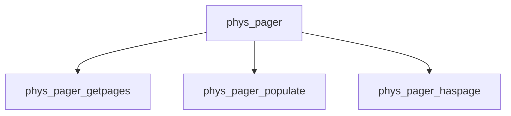

# Component: phys_pager.c

**Path:** `sys/vm/phys_pager.c`
**Type:** File
**Maps to:** `.discovery/sys/vm/phys_pager.md`

## Purpose

Physical pager - pager for physical memory-backed VM objects.

## Structure

## Key Functions

| Function | Purpose | Signature |
|----------|---------|-----------|
| `phys_pager_getpages` | Get pages | `int phys_pager_getpages(vm_object_t object, vm_page_t *m, int count, int *rbehind, int *rahead)` |
| `phys_pager_populate` | Populate | `int phys_pager_populate(vm_object_t object, vm_pindex_t pidx, int fault_type, vm_prot_t max_prot, vm_pindex_t *first, vm_pindex_t *last)` |
| `phys_pager_haspage` | Has page | `boolean_t phys_pager_haspage(vm_object_t object, vm_pindex_t pindex, int *before, int *after)` |

## Use Cases

| Use | Description |
|-----|-------------|
| `physical` | Physical pager |
| `vm` | VM subsystem |

## Includes

- `vm/vm_pager.h` - Pager definitions