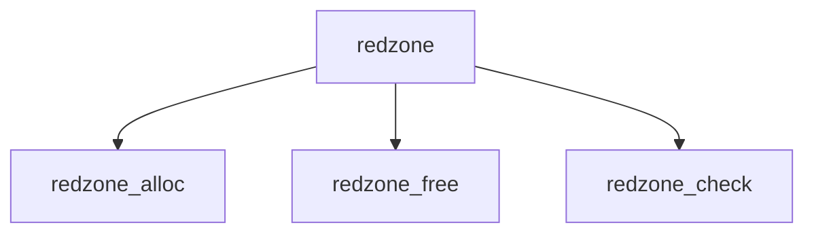

# Component: redzone.c

**Path:** `sys/vm/redzone.c`
**Type:** File
**Maps to:** `.discovery/sys/vm/redzone.md`

## Purpose

Redzone - buffer overflow detection via red zones.

## Structure

## Key Functions

| Function | Purpose | Signature |
|----------|---------|-----------|
| `redzone_alloc` | Allocate | `void *redzone_alloc(struct malloc_type *type, size_t size, int flags)` |
| `redzone_free` | Free | `void redzone_free(void *addr, size_t size)` |
| `redzone_check` | Check | `void redzone_check(void *addr, size_t size)` |

## Use Cases

| Use | Description |
|-----|-------------|
| `debug` | Buffer debugging |
| `overflow` | Overflow detection |

## Includes

- `vm/redzone.h` - Redzone definitions