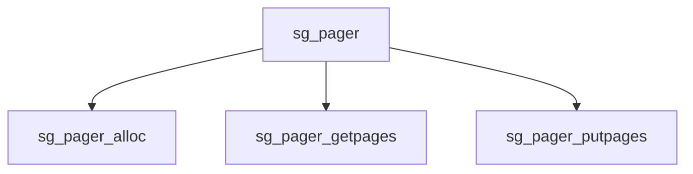

# Component: sg_pager.c

**Path:** `sys/vm/sg_pager.c`
**Type:** File
**Maps to:** `.discovery/sys/vm/sg_pager.md`

## Purpose

Scatter/gather pager - pager for scatter/gather DMA memory objects.

## Structure

## Key Functions

| Function | Purpose | Signature |
|----------|---------|-----------|
| `sg_pager_alloc` | Allocate | `vm_object_t sg_pager_alloc(void *handle, vm_ooffset_t size, vm_prot_t prot, vm_ooffset_t foff, struct ucred *cred)` |
| `sg_pager_getpages` | Get pages | `int sg_pager_getpages(vm_object_t object, vm_page_t *pages, int count, int *rbehind, int *rahead)` |
| `sg_pager_putpages` | Put pages | `void sg_pager_putpages(vm_object_t object, vm_page_t *pages, int count, int sync, int *rtot)` |

## Use Cases

| Use | Description |
|-----|-------------|
| `scatter` | Scatter/gather |
| `dma` | DMA memory |

## Includes

- `vm/vm_pager.h` - Pager definitions