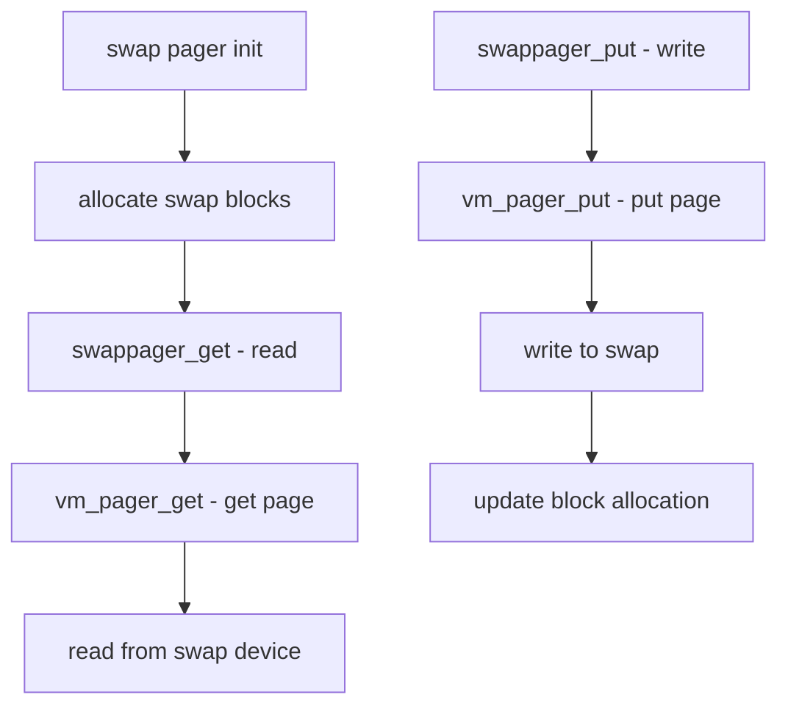

# Component: swap_pager.c

**Path:** `sys/vm/swap_pager.c`
**Type:** File
**Maps to:** `.discovery/sys/vm/swap_pager.md`

## Purpose

Swap pager - manages swapping pages between memory and disk. Handles reading pages from swap when faults occur and writing dirty pages to swap.

## Structure

## Key Functions

| Function | Purpose | Signature |
|----------|---------|-----------|
| `swappager_init` | Initialize swap | `void swappager_init(void)` |
| `swappager_get` | Get from swap | `int swappager_get(vm_object_t object, ...)` |
| `swappager_put` | Put to swap | `int swappager_put(vm_object_t object, ...)` |
| `swappager_haspage` | Check if in swap | `int swappager_haspage(vm_object_t object, ...)` |
| `swappager_deallocate` | Free swap | `void swappager_deallocate(vm_object_t object)` |
| `swapon` | Enable swap device | `int swapon(const char *name)` |
| `swapoff` | Disable swap device | `int swapoff(const char *name)` |

## Swap Block Allocation

- Uses radix bitmap (blist)
- Blocks are allocated on demand
- Deallocated when page is freed

## Swap Configuration

| Parameter | Description |
|-----------|-------------|
| `vm.swap_enabled` | Swap on/off |
| `vm.swap_size` | Total swap size |
| `vm.nswapdev` | Number of swap devices |

## Pager Operations

| Operation | Description |
|----------|-------------|
| `get` | Read from backing store |
| `put` | Write to backing store |
| `haspage` | Check if page exists |

## Includes

- `vm/swap_pager.h` - Swap definitions
- `vm/vm_pager.h` - Generic pager
- `vm/vm_object.h` - VM objects

## Depends On

- `vm_pager.c` for pager interface
- `device_pager.c` for swap device