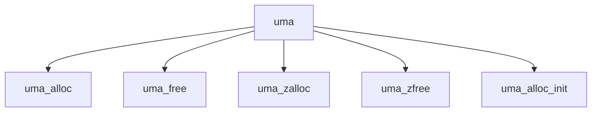

# Component: uma_core.c

**Path:** `sys/vm/uma_core.c`
**Type:** File
**Maps to:** `.discovery/sys/vm/uma_core.md`

## Purpose

Universal Memory Allocator - kernel memory allocator (slab/zone allocator).

## Structure

## Key Functions

| Function | Purpose | Signature |
|----------|---------|-----------|
| `uma_alloc` | Allocate | `void *uma_alloc(struct uma_bucket *bucket, int size)` |
| `uma_free` | Free | `void uma_free(void *item, void *arg)` |
| `uma_zalloc` | Zone alloc | `void *uma_zalloc(char *zone, int flags)` |
| `uma_zfree` | Zone free | `void uma_zfree(char *zone, void *item)` |
| `uma_alloc_init` | Init | `void uma_alloc_init(void)` |

## UMA Zones

| Zone | Description |
|------|-------------|
| `M_` | Malloc types |
| `UMA` | UMA zones |

## Use Cases

| Use | Description |
|-----|-------------|
| `allocator` | Kernel malloc |
| `slab` | Slab allocator |

## Includes

- `vm/uma.h` - UMA definitions