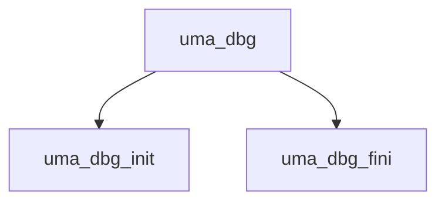

# Component: uma_dbg.c

**Path:** `sys/vm/uma_dbg.c`
**Type:** File
**Maps to:** `.discovery/sys/vm/uma_dbg.md`

## Purpose

UMA debugging - debugging features for the Universal Memory Allocator.

## Structure

## Key Functions

| Function | Purpose | Signature |
|----------|---------|-----------|
| `uma_dbg_init` | Init | `void uma_dbg_init(void)` |
| `uma_dbg_fini` | Fini | `void uma_dbg_fini(void)` |

## Use Cases

| Use | Description |
|-----|-------------|
| `debug` | UMA debugging |
| `allocator` | Memory allocator |

## Includes

- `vm/uma_dbg.h` - UMA debug definitions