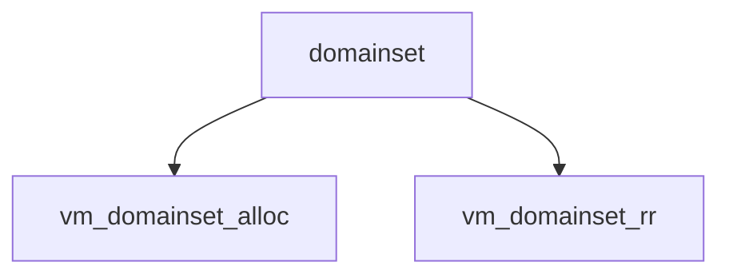

# Component: vm_domainset.c

**Path:** `sys/vm/vm_domainset.c`
**Type:** File
**Maps to:** `.discovery/sys/vm/vm_domainset.md`

## Purpose

NUMA domain set - memory domain allocation for NUMA systems.

## Structure

## Key Functions

| Function | Purpose | Signature |
|----------|---------|-----------|
| `vm_domainset_alloc` | Allocate domain | `int vm_domainset_alloc(void)` |
| `vm_domainset_rr` | Round-robin | `int vm_domainset_rr(struct domainset *d, int flags)` |

## Use Cases

| Use | Description |
|-----|-------------|
| `numa` | NUMA support |
| `domain` | Memory domain |

## Includes

- `vm/vm_domainset.h` - Domainset definitions