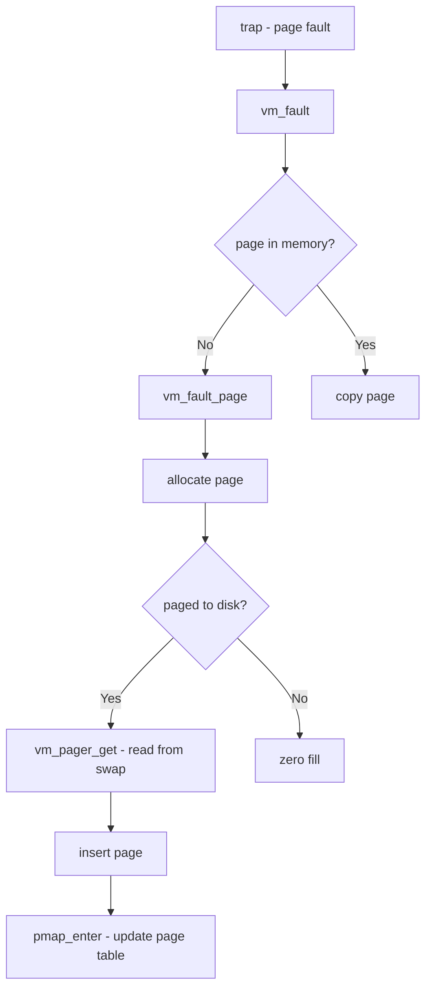

# Component: vm_fault.c

**Path:** `sys/vm/vm_fault.c`
**Type:** File
**Maps to:** `.discovery/sys/vm/vm_fault.md`

## Purpose

Page fault handling - handles memory faults when processes access unmapped or paged-out memory. Allocates pages, reads from disk if needed, and updates page tables.

## Structure

## Key Functions

| Function | Purpose | Signature |
|----------|---------|-----------|
| `vm_fault` | Main fault handler | `int vm_fault(vm_map_t map, vm_offset_t vaddr, vm_fault_t mode, int page_class)` |
| `vm_fault_page` | Handle page fault | `int vm_fault_page(vm_map_t map, vm_object_t object, ...)` |
| `vm_fault_copy` | Copy on fault | `void vm_fault_copy(dst_page, src_page)` |
| `vm_fault_type` | Get fault type | `int vm_fault_type(int ftype)` |
| `vm_page_fault` | Page fault per-page | `int vm_page_fault(vm_page_t m, vm_offset_t vaddr, int ftype)` |

## Fault Types

| Type | Value | Description |
|------|-------|-------------|
| `VM_FAULT_NORMAL` | 0 | Normal fault |
| `VM_FAULT_RW` | 1 | Read/write fault |
| `VM_FAULT_UNMANAGED` | 2 | Unmanaged page |

## Fault Mode

| Mode | Description |
|------|-------------|
| `VM_FAULT_READ` | Read fault |
| `VM_FAULT_WRITE` | Write fault |
| `VM_FAULT_MAX` | Max valid |

## Page Classes

| Class | Description |
|-------|-------------|
| `PG_CLASS_NORMAL` | Normal pages |
| `PG_CLASS_PHANTOM` | Phantom pages |

## Includes

- `vm/vm_fault.h` - Fault definitions
- `vm/vm_map.h` - Virtual map
- `vm/vm_object.h` - VM objects

## Depends On

- `vm_page.c` for page allocation
- `vm_pager.c` for paging operations
- `pmap` for page table updates