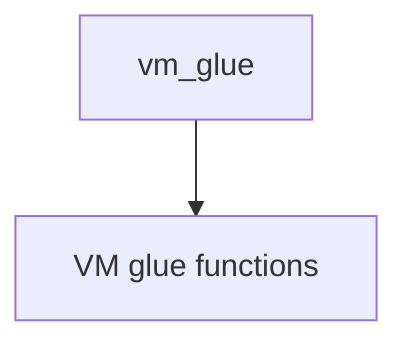

# Component: vm_glue.c

**Path:** `sys/vm/vm_glue.c`
**Type:** File
**Maps to:** `.discovery/sys/vm/vm_glue.md`

## Purpose

VM glue - VM system glue code and miscellaneous interfaces.

## Structure

## Key Functions

| Function | Purpose |
|----------|---------|
| `vm_glue_init` | Initialize glue |
| `vm_glue_cleanup` | Cleanup |

## Use Cases

| Use | Description |
|-----|-------------|
| `glue` | VM glue |
| `interface` | System interface |

## Includes

- `vm/vm.h` - VM definitions