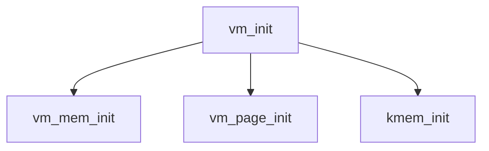

# Component: vm_init.c

**Path:** `sys/vm/vm_init.c`
**Type:** File
**Maps to:** `.discovery/sys/vm/vm_init.md`

## Purpose

Virtual memory subsystem initialization - VM system boot-time initialization.

## Structure

## Key Functions

| Function | Purpose | Signature |
|----------|---------|-----------|
| `vm_mem_init` | Memory init | `void vm_mem_init(void)` |
| `kmem_init` | Kernel mem | `void kmem_init(struct kmem_dyn *, vm_offset_t)` |

## Use Cases

| Use | Description |
|-----|-------------|
| `vm` | VM init |

## Includes

- `vm/vm.h` - VM definitions