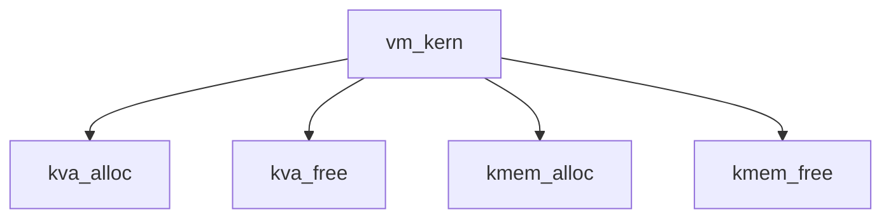

# Component: vm_kern.c

**Path:** `sys/vm/vm_kern.c`
**Type:** File
**Maps to:** `.discovery/sys/vm/vm_kern.md`

## Purpose

Kernel virtual memory - kernel virtual memory allocation and management.

## Structure

## Key Functions

| Function | Purpose | Signature |
|----------|---------|-----------|
| `kva_alloc` | Allocate KVA | `vm_offset_t kva_alloc(size_t size)` |
| `kva_free` | Free KVA | `void kva_free(vm_offset_t va, size_t size)` |
| `kmem_alloc` | Alloc | `void *kmem_alloc(struct vm_domain *, size_t size, int flags)` |
| `kmem_free` | Free | `void kmem_free(void *addr, size_t size)` |

## Kernel Memory

| Function | Description |
|----------|-------------|
| `kmem_alloc` | Allocate kernel memory |
| `kmem_free` | Free kernel memory |

## Use Cases

| Use | Description |
|-----|-------------|
| `kernel` | Kernel memory |
| `vm` | Virtual memory |

## Includes

- `vm/vm.h` - VM definitions
- `vm/vm_kern.h` - Kernel VM