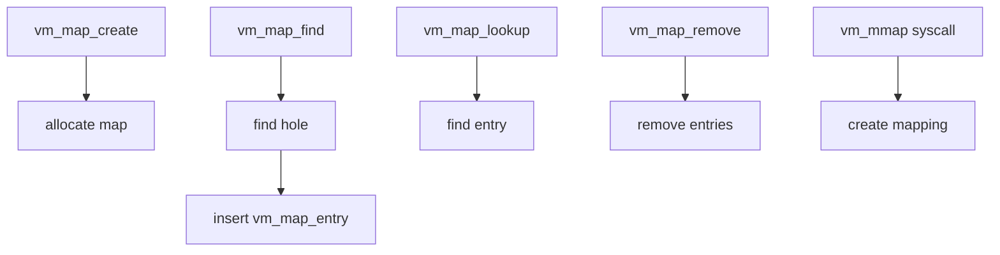

# Component: vm_map.c

**Path:** `sys/vm/vm_map.c`
**Type:** File
**Maps to:** `.discovery/sys/vm/vm_map.md`

## Purpose

Virtual address space management - manages per-process virtual memory maps. Tracks which regions of virtual address space are allocated, what they're mapped to (anonymous, file, device), and their protection bits.

## Structure

## Key Functions

| Function | Purpose | Signature |
|----------|---------|-----------|
| `vm_map_create` | Create new map | `vm_map_t vm_map_create(vm_offset_t min, vm_offset_t max)` |
| `vm_map_destroy` | Destroy map | `void vm_map_destroy(vm_map_t map)` |
| `vm_map_find` | Find/free space | `kern_return_t vm_map_find(vm_map_t map, vm_object_t object, ...)` |
| `vm_map_insert` | Insert mapping | `kern_return_t vm_map_insert(vm_map_t map, ...)` |
| `vm_map_lookup` | Find entry | `kern_return_t vm_map_lookup(...)` |
| `vm_map_remove` | Remove range | `void vm_map_remove(vm_map_t map, vm_offset_t start, vm_offset_t end)` |
| `vm_map_lock` | Lock map | `void _vm_map_lock(vm_map_t map, const char *file, int line)` |
| `vm_map_unlock` | Unlock map | `void _vm_map_unlock(vm_map_t map, const char *file, int line)` |

## VM Map Entry

| Field | Description |
|-------|-------------|
| `start` | Start address |
| `end` | End address |
| `offset` | Offset in object |
| `object` | VM object |
| `protection` | Read/write/exec |
| `max_protection` | Maximum allowed |

## Map Types

| Type | Description |
|------|-------------|
| `VM_MAP_USER` | User process map |
| `VM_MAP_KERNEL` | Kernel map |
| `VM_MAP_BSD` | BSD kernel map |
| `VM_MAP_SUBMAP` | Submap |

## Includes

- `vm/vm_map.h` - Map definitions
- `vm/vm_object.h` - VM objects
- `vm/pmap.h` - Physical map

## Depends On

- `vm_object.c` for backing objects
- `vm_fault.c` for page faults
- `pmap` for hardware mapping