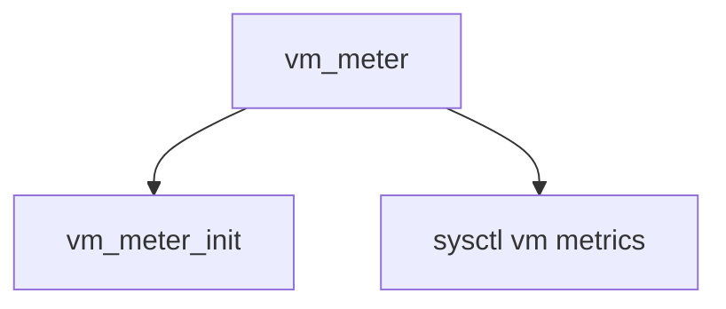

# Component: vm_meter.c

**Path:** `sys/vm/vm_meter.c`
**Type:** File
**Maps to:** `.discovery/sys/vm/vm_meter.md`

## Purpose

VM meter - virtual memory statistics and sysctl nodes.

## Structure

## Key Structures

| Structure | Description |
|-----------|-------------|
| `vmmeter` | VM counters |

## Statistics

| Stat | Description |
|------|-------------|
| `v_swtch` | Context switches |
| `v_trap` | Traps |
| `v_intr` | Interrupts |

## Sysctl Nodes

| Node | Description |
|------|-------------|
| `vm.stats` | VM statistics |
| `vm.vmmeter` | VM meter |

## Use Cases

| Use | Description |
|-----|-------------|
| `stats` | VM stats |
| `sysctl` | Sysctl |

## Includes

- `sys/vmmeter.h` - VM meter definitions