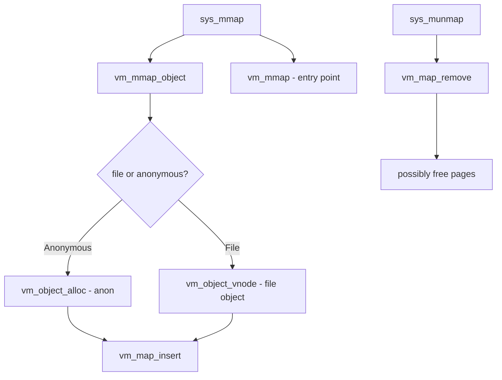

# Component: vm_mmap.c

**Path:** `sys/vm/vm_mmap.c`
**Type:** File
**Maps to:** `.discovery/sys/vm/vm_mmap.md`

## Purpose

Memory map syscall (mmap/munmap) - implements mmap(2) and munmap(2) system calls for creating, resizing, and deleting memory mappings.

## Structure

## Key Functions

| Function | Purpose | Signature |
|----------|---------|-----------|
| `sys_mmap` | mmap syscall | `int sys_mmap(struct thread *td, struct mmap_args *uap)` |
| `sys_munmap` | munmap syscall | `int sys_munmap(struct thread *td, struct munmap_args *uap)` |
| `sys_mprotect` | Change protection | `int sys_mprotect(struct thread *td, struct mprotect_args *uap)` |
| `sys_madvise` | Give advice | `int sys_madvise(struct thread *td, struct madvise_args *uap)` |
| `sys_mincore` | Page info | `int sys_mincore(struct thread *td, struct mincore_args *uap)` |
| `sys_mlock` | Lock pages | `int sys_mlock(struct thread *td, struct mlock_args *uap)` |
| `sys_munlock` | Unlock pages | `int sys_munlock(struct thread *td, struct munlock_args *uap)` |
| `sys_mlockall` | Lock all | `int sys_mlockall(struct thread *td, struct mlockall_args *uap)` |
| `sys_munlockall` | Unlock all | `int sys_munlockall(struct thread *td)` |

## Map Flags (mmap)

| Flag | Description |
|------|-------------|
| `PROT_READ` | Read access |
| `PROT_WRITE` | Write access |
| `PROT_EXEC` | Execute access |
| `MAP_SHARED` | Shared mapping |
| `MAP_PRIVATE` | Private copy-on-write |
| `MAP_FIXED` | Exact address |
| `MAP_ANON` | Anonymous (no file) |
| `MAP_NORESERVE` | No swap reservation |

## Advice (madvise)

| Advice | Description |
|--------|-------------|
| `MADV_NORMAL` | Normal access |
| `MADV_RANDOM` | Random access |
| `MADV_SEQUENTIAL` | Sequential access |
| `MADV_WILLNEED` | Preload pages |
| `MADV_DONTNEED` | Drop pages |
| `MADV_FREE` | Pages are free |

## Includes

- `vm/vm_map.h` - Virtual memory maps
- `vm/vm_object.h` - VM objects
- `sys/mman.h` - Memory management definitions

## Depends On

- `vm_map.c` for address space management
- `vm_object.c` for backing objects
- `vnode_pager.c` for file mappings