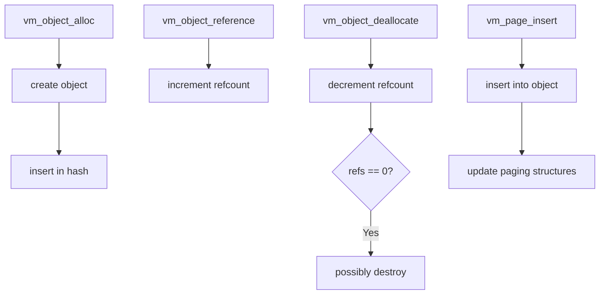

# Component: vm_object.c

**Path:** `sys/vm/vm_object.c`
**Type:** File
**Maps to:** `.discovery/sys/vm/vm_object.md`

## Purpose

VM object management - manages backing store for memory mappings. Objects represent memory regions that can be mapped into address spaces, backing anonymous memory, files, or devices.

## Structure



## Key Functions

| Function | Purpose | Signature |
|----------|---------|-----------|
| `vm_object_alloc` | Allocate object | `vm_object_t vm_object_alloc(vm_object_offset_t size)` |
| `vm_object_reference` | Add reference | `void vm_object_reference(vm_object_t object)` |
| `vm_object_deallocate` | Drop reference | `void vm_object_deallocate(vm_object_t object)` |
| `vm_object_lock` | Lock object | `void _vm_object_lock(vm_object_t obj, const char *file, int line)` |
| `vm_object_unlock` | Unlock object | `void _vm_object_unlock(vm_object_t obj, const char *file, int line)` |
| `vm_object_page_insert` | Insert page | `void vm_object_page_insert(vm_object_t obj, vm_page_t m)` |
| `vm_object_page_remove` | Remove page | `void vm_object_page_remove(...)` |
| `vm_object_shadow` | Create shadow | `vm_object_t vm_object_shadow(...)` |

## Object Types

| Type | Description |
|------|-------------|
| `OBJT_DEFAULT` | Default/unknown |
| `OBJT_VNODE` | Backed by vnode |
| `OBJT_SWAP` | Paged to swap |
| `OBJT_DEVICE` | Device memory |
| `OBJT_PHYSICAL` | Physical contiguous |
| `OBJT_MGTDEVICE` | Managed device |

## Object Structure

```c
struct vm_object {
    obj_type_t type;           // Object type
    int ref_count;             // Reference count
    vm_object_t shadow;        // Shadow object
    vm_offset_t size;          // Object size
    TAILQ_ENTRY(vm_object) object_list; // Global list
    TAILQ_HEAD(, vm_page) memq; // Pages in object
    // ... more fields
};
```

## Includes

- `vm/vm_object.h` - Object definitions
- `vm/vm_page.h` - Page structures
- `vm/vm_fault.h` - Fault handling

## Depends On

- `vm_map.c` for map entries
- `vm_fault.c` for page faults
- `vnode_pager.c` for vnode-backed objects