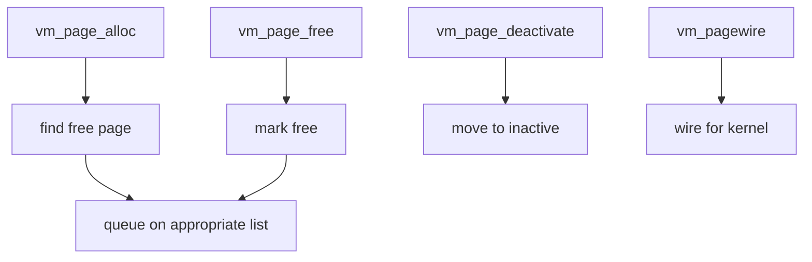

# Component: vm_page.c

**Path:** `sys/vm/vm_page.c`
**Type:** File
**Maps to:** `.discovery/sys/vm/vm_page.md`

## Purpose

Physical page management - manages physical memory pages (vm_page_t). Tracks page state (free, active, inactive, wired), manages page queues, and handles page allocation/deallocation.

## Structure

## Key Functions

| Function | Purpose | Signature |
|----------|---------|-----------|
| `vm_page_alloc` | Allocate page | `vm_page_t vm_page_alloc(vm_object_t obj, vm_pindex_t pindex, int req)` |
| `vm_page_free` | Free page | `void vm_page_free(vm_page_t m)` |
| `vm_page_free_prepare` | Prep for free | `void vm_page_free_prepare(vm_page_t m)` |
| `vm_page_wire` | Wire page | `void vm_page_wire(vm_page_t m)` |
| `vm_page_unwire` | Unwire page | `void vm_page_unwire(vm_page_t m, int activate)` |
| `vm_page_deactivate` | Move to inactive | `void vm_page_deactivate(vm_page_t m)` |
| `vm_page_repurpose` | Repurpose page | `void vm_page_repurpose(vm_page_t m)` |
| `vm_page_lookup` | Find page | `vm_page_t vm_page_lookup(vm_object_t obj, vm_pindex_t pindex)` |
| `vm_page_prev` | Previous in object | `vm_page_t vm_page_prev(vm_page_t m)` |
| `vm_page_next` | Next in object | `vm_page_t vm_page_next(vm_page_t m)` |

## Page States

| State | Description |
|-------|-------------|
| `PG_CLEAN` | Not modified |
| `PG_DIRTY` | Modified |
| `PG_BUSY` | I/O in progress |
| `PG_FICTITIOUS` | Not real memory |
| `PG_WRITEABLE` | Writable mapping |
| `PG_MANAGED` | In page queues |

## Page Queues

| Queue | Purpose |
|-------|---------|
| `vm_page queues.active` | Recently used |
| `vm_page queues.inactive` | Not recently used |
| `vm_page queues.unused` | Free/empty |
| `vm_page queues.wired` | Kernel wired |

## Includes

- `vm/vm_page.h` - Page structures
- `vm/vm_object.h` - Object definitions
- `vm/uma.h` - UMA allocator

## Depends On

- `vm_phys.c` for physical memory
- `vm_pageout.c` for pageout daemon
- `pmap` for page table updates