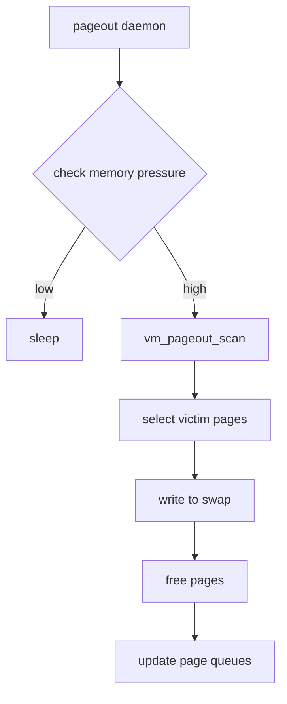

# Component: vm_pageout.c

**Path:** `sys/vm/vm_pageout.c`
**Type:** File
**Maps to:** `.discovery/sys/vm/vm_pageout.md`

## Purpose

Pageout daemon - manages swapping pages in and out of memory. The pageout daemon (pageout) is a kernel thread that moves pages between memory and swap space.

## Structure

## Key Functions

| Function | Purpose | Signature |
|----------|---------|-----------|
| `vm_pageout_init` | Initialize pageout | `void vm_pageout_init(void)` |
| `vm_pageout` | Pageout daemon | `static void vm_pageout(void *arg)` |
| `vm_pageout_scan` | Scan for pages | `static void vm_pageout_scan(int pass)` |
| `vm_pageout_laundry` | Launder dirty pages | `static void vm_pageout_laundry(...)` |
| `vm_pager_haspage` | Check backing | `int vm_pager_haspage(vm_object_t obj, vm_pindex_t pindex)` |

## Page Laundering

| Step | Description |
|------|-------------|
| 1 | Select inactive pages |
| 2 | Clean or write to swap |
| 3 | Move to free queue |

## Page Daemon

| Setting | Description |
|---------|-------------|
| `vm.panic` | Panic on OOM |
| `vm.pageout` | Daemon sleep time |

## Includes

- `vm/vm_page.h` - Page structures
- `vm/vm_object.h` - VM objects
- `vm/swap_pager.h` - Swap pager

## Depends On

- `vm_page.c` for page management
- `swap_pager.c` for swap I/O
- `vm_map.c` for address space