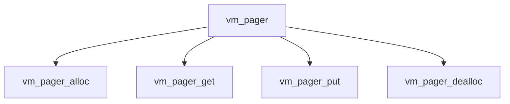

# Component: vm_pager.c

**Path:** `sys/vm/vm_pager.c`
**Type:** File
**Maps to:** `.discovery/sys/vm/vm_pager.md`

## Purpose

Pager infrastructure - generic pager interface for VM objects.

## Structure

## Key Functions

| Function | Purpose | Signature |
|----------|---------|-----------|
| `vm_pager_alloc` | Allocate | `vm_pager_t vm_pager_alloc(void *handle, vm_ooffset_t size, vm_prot_t prot, vm_ooffset_t foff)` |
| `vm_pager_get` | Get page | `int vm_pager_get(vm_pager_t pager, vm_page_t m, boolean_t sync)` |
| `vm_pager_put` | Put page | `int vm_pager_put(vm_pager_t pager, vm_page_t m, boolean_t sync)` |
| `vm_pager_dealloc` | Deallocate | `void vm_pager_dealloc(vm_pager_t pager)` |

## Pager Types

| Type | Description |
|------|-------------|
| `OBJT_DEFAULT` | Default |
| `OBJT_SWAP` | Swap |
| `OBJT_VNODE` | Vnode |

## Use Cases

| Use | Description |
|-----|-------------|
| `pager` | VM pager |

## Includes

- `vm/vm_pager.h` - Pager definitions