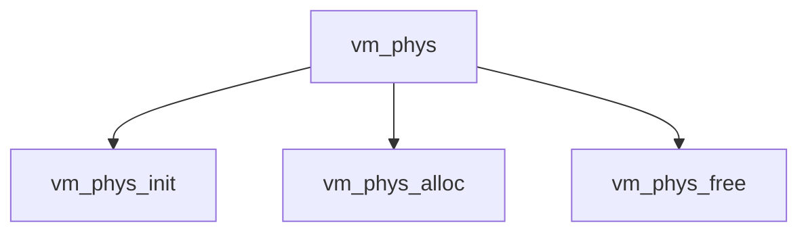

# Component: vm_phys.c

**Path:** `sys/vm/vm_phys.c`
**Type:** File
**Maps to:** `.discovery/sys/vm/vm_phys.md`

## Purpose

Physical memory manager - physical memory allocation and management.

## Structure

## Key Functions

| Function | Purpose | Signature |
|----------|---------|-----------|
| `vm_phys_init` | Init | `void vm_phys_init(void)` |
| `vm_phys_alloc` | Alloc | `struct vm_page *vm_phys_alloc(int domain, int order, int flags)` |
| `vm_phys_free` | Free | `void vm_phys_free(struct vm_page *pg)` |

## Physical Memory

| Function | Description |
|----------|-------------|
| `vm_phys_alloc` | Allocate pages |
| `vm_phys_free` | Free pages |

## Use Cases

| Use | Description |
|-----|-------------|
| `physical` | Physical memory |
| `vm` | Virtual memory |

## Includes

- `vm/vm_phys.h` - Physical memory definitions