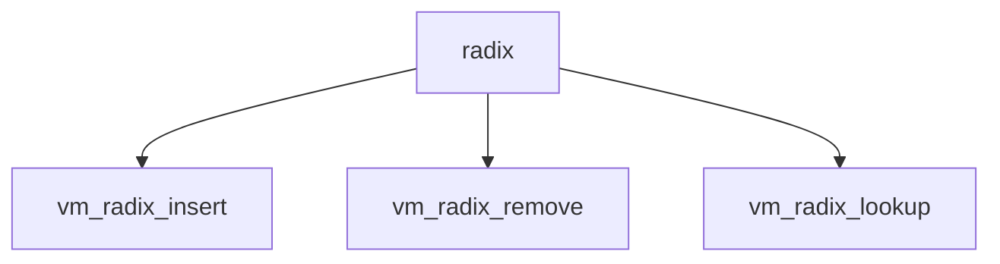

# Component: vm_radix.c

**Path:** `sys/vm/vm_radix.c`
**Type:** File
**Maps to:** `.discovery/sys/vm/vm_radix.md`

## Purpose

Radix trie - path-compressed radix trie for VM map entries.

## Structure

## Key Functions

| Function | Purpose | Signature |
|----------|---------|-----------|
| `vm_radix_insert` | Insert | `int vm_radix_insert(struct vm_radix *rt, vm_map_entry_t entry)` |
| `vm_radix_remove` | Remove | `void vm_radix_remove(struct vm_radix *rt, vm_map_entry_t entry)` |
| `vm_radix_lookup` | Lookup | `vm_map_entry_t vm_radix_lookup(struct vm_radix *rt, vm_offset_t key)` |

## Use Cases

| Use | Description |
|-----|-------------|
| `vm_map` | VM map entries |
| `trie` | Radix trie |

## Includes

- `vm/vm_radix.h` - Radix definitions