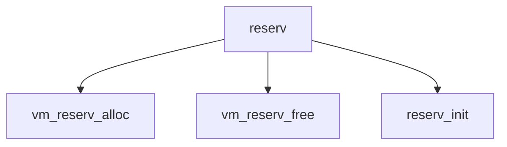

# Component: vm_reserv.c

**Path:** `sys/vm/vm_reserv.c`
**Type:** File
**Maps to:** `.discovery/sys/vm/vm_reserv.md`

## Purpose

Superpage reservations - superpage reservation management for large pages.

## Structure

## Key Functions

| Function | Purpose | Signature |
|----------|---------|-----------|
| `vm_reserv_alloc` | Allocate | `struct vm_page *vm_reserv_alloc(int domain, int order, int flags)` |
| `vm_reserv_free` | Free | `void vm_reserv_free(struct vm_page *page)` |
| `vm_reserv_reclaim` | Reclaim | `int vm_reserv_reclaim(int domain)` |

## Use Cases

| Use | Description |
|-----|-------------|
| `superpages` | Superpage support |
| `vm` | VM subsystem |

## Includes

- `vm/vm_reserv.h` - Reservation definitions