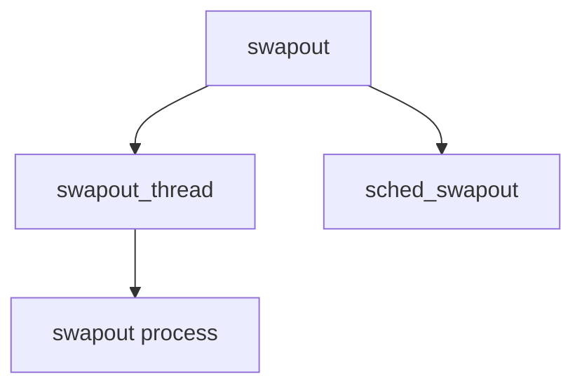

# Component: vm_swapout.c

**Path:** `sys/vm/vm_swapout.c`
**Type:** File
**Maps to:** `.discovery/sys/vm/vm_swapout.md`

## Purpose

Swapout daemon - background thread that swaps out inactive processes.

## Structure

## Key Functions

| Function | Purpose | Signature |
|----------|---------|-----------|
| `swapout_thread` | Thread | `static void swapout_thread(void *arg)` |
| `sched_swapout` | Schedule | `void sched_swapout(struct proc *p)` |

## Swapout Daemon

| Item | Description |
|------|-------------|
| `swapout_thread` | Main thread |
| `sched_swapout` | Schedule swapout |

## Use Cases

| Use | Description |
|-----|-------------|
| `swap` | Swap management |
| `vm` | VM subsystem |

## Includes

- `vm/vm_map.h` - VM map definitions