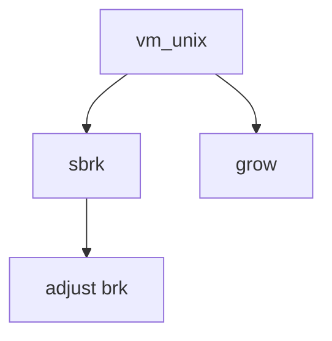

# Component: vm_unix.c

**Path:** `sys/vm/vm_unix.c`
**Type:** File
**Maps to:** `.discovery/sys/vm/vm_unix.md`

## Purpose

Unix VM interface - traditional sbrk/grow interface to VM system.

## Structure

## Key Functions

| Function | Purpose | Signature |
|----------|---------|-----------|
| `sbrk` | Sbrk | `int sbrk(struct thread *td, struct sbrk_args *uap)` |
| `sstk` | Storage | `int sstk(struct thread *td, struct sstk_args *uap)` |
| `grow` | Grow | `int grow(struct thread *td, struct grow_args *uap)` |

## Use Cases

| Use | Description |
|-----|-------------|
| `brk` | Break pointer |
| `vm` | VM interface |

## Includes

- `vm/vm.h` - VM definitions