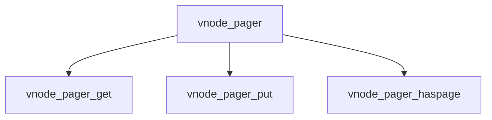

# Component: vnode_pager.c

**Path:** `sys/vm/vnode_pager.c`
**Type:** File
**Maps to:** `.discovery/sys/vm/vnode_pager.md`

## Purpose

Vnode pager - pager for vnode-backed VM objects.

## Structure

## Key Functions

| Function | Purpose | Signature |
|----------|---------|-----------|
| `vnode_pager_get` | Get pages | `int vnode_pager_get(struct vnode *vp, vm_page_t *pages, int count)` |
| `vnode_pager_put` | Put pages | `int vnode_pager_put(struct vnode *vp, vm_page_t *pages, int count)` |
| `vnode_pager_haspage` | Has page | `boolean_t vnode_pager_haspage(struct vnode *vp, vm_pindex_t pindex)` |

## Use Cases

| Use | Description |
|-----|-------------|
| `vnode` | Vnode pager |
| `file` | File I/O |

## Includes

- `vm/vnode_pager.h` - Vnode pager definitions