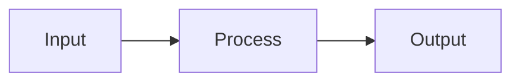

# Skills — Codebase Map

**Source:** https://github.com/cloudbsdorg/application_guidelines/tree/main/SKILLS
**Total Skills:** 41

## Overview

The SKILLS directory contains specialized AI agent skills for common development tasks. Each skill is a markdown document that provides detailed instructions for specific development workflows.

## Skill Invocation Format

When loading a skill, wrap content with invocation markers:

```
===SKILL:skill-name===
[skill content]
===END SKILL===
```

## Skills Index

### Project Initialization (6 skills)

| Skill | Purpose |
|-------|---------|
| `plan-document-generator.md` | Create plan documents following standard templates |
| `toc-generator.md` | Create table of contents documents |
| `agents-start-here-generator.md` | Generate agent entry point document |
| `build-status-updater.md` | Maintain CI/CD build status |
| `quick-reference-generator.md` | Create Quick Reference sections |
| `progress-tracker-updater.md` | Create and maintain TODO Tracker Summary tables |

### Task Management (1 skill)

| Skill | Purpose |
|-------|---------|
| `task-workflow.md` | Task claiming, completion, and status management |

### Technical Documentation (4 skills)

| Skill | Purpose |
|-------|---------|
| `sysctl-documenter.md` | Document sysctl MIB hierarchies |
| `ascii-diagrammer.md` | Generate architecture diagrams |
| `test-planner.md` | Generate testing documentation |
| `risk-assessor.md` | Create and maintain risk registers |

### Quality Assurance (1 skill)

| Skill | Purpose |
|-------|---------|
| `plan-validator.md` | Validate plan document compliance |

### Code Porting (6 skills)

| Skill | Purpose |
|-------|---------|
| `reverse-engineer-for-port.md` | Analyze source code for actual behavior |
| `feature-task-generator.md` | Generate tasks from feature analysis |
| `code-quality-analyzer.md` | Find duplication and plan refactoring |
| `ui-ux-analyzer.md` | Document UI objects, states, actions, and data flow |
| `api-analyzer.md` | Document REST endpoints, HTTP protocols, request/response formats |
| `message-queue-analyzer.md` | Document message brokers, queues, pub/sub patterns |

### OS Analysis (5 skills)

| Skill | Purpose |
|-------|---------|
| `system-call-analyzer.md` | Analyze syscalls, file I/O, memory ops, signals, debugging |
| `process-model-analyzer.md` | Document threads, processes, IPC, synchronization patterns |
| `network-stack-analyzer.md` | Document sockets, TCP/UDP, epoll/kqueue, SSL/TLS |
| `file-system-analyzer.md` | Document paths, permissions, locking, extended attributes |
| `privilege-analyzer.md` | Document UID/GID, capabilities, ACLs, chroot, securelevel |

### Analysis Orchestration (1 skill)

| Skill | Purpose |
|-------|---------|
| `source-analysis-orchestrator.md` | Coordinate all analysis skills for pre-planning |

### FreeBSD System Administration (6 skills)

| Skill | Purpose |
|-------|---------|
| `bhyve-manager.md` | Create and manage bhyve VMs with vm-bhyve |
| `jail-manager.md` | Manage FreeBSD jails with iocage, bastille, pot |
| `zfs-manager.md` | ZFS pool management, snapshots, safety rules |
| `linuxulator-runner.md` | Run Linux binaries on FreeBSD with Linuxulator |
| `rc-script-writer.md` | Write FreeBSD rc.d startup scripts |
| `service-manager.md` | Manage FreeBSD services with rc.d and sysrc |

### Development Workflow (5 skills)

| Skill | Purpose |
|-------|---------|
| `codebase-mapper.md` | Map any codebase into exhaustive tree-view markdown documents |
| `effect.md` | Work with Effect v4 / effect-smol TypeScript code |
| `github-triage.md` | Read-only GitHub triage for issues and PRs |
| `pre-publish-review.md` | Nuclear-grade 16-agent pre-publish release gate |
| `work-with-pr.md` | Full PR lifecycle: worktree → implement → PR → merge |

### Cloudflare Platform (2 skills)

| Skill | Purpose |
|-------|---------|
| `cloudflare.md` | Comprehensive Cloudflare platform (Workers, Pages, storage, AI) |
| `agents-sdk.md` | Build AI agents on Cloudflare Workers using Agents SDK |

## Skill Dependency Graph

```
agents-start-here-generator
     │
     ├──► toc-generator
     │        └──► plan-document-generator
     │
     ├──► task-workflow
     │
     ├──► plan-document-generator
     │        │
     │        ├──► ascii-diagrammer
     │        ├──► sysctl-documenter
     │        ├──► risk-assessor
     │        ├──► test-planner
     │        └──► toc-generator
     │
     ├──► quick-reference-generator
     │
     ├──► progress-tracker-updater
     │
     └──► build-status-updater

plan-validator (standalone - validates all of the above)

reverse-engineer-for-port
     │
     └──► feature-task-generator
               │
               └──► code-quality-analyzer (optional)

ui-ux-analyzer (standalone)

api-analyzer (standalone)

message-queue-analyzer (standalone)

system-call-analyzer ───────────┐
                                │
process-model-analyzer ─────────┼── (OS analysis skills)
                                │
network-stack-analyzer ─────────┤
                                │
file-system-analyzer ──────────┤
                                │
privilege-analyzer ────────────┘

source-analysis-orchestrator
     │
     ├──► reverse-engineer-for-port
     ├──► ui-ux-analyzer
     ├──► api-analyzer
     ├──► message-queue-analyzer
     ├──► code-quality-analyzer
     └──► OS skills (as needed)
             │
             ▼
     feature-task-generator ──► plan-document-generator

codebase-mapper (standalone)

effect (standalone)

github-triage (standalone)

pre-publish-review
     │
     ├──► review-work (5-agent)
     └──► oracle

work-with-pr
     │
     ├──► git-master
     └──► review-work
```

## Pre-Planning Analysis Workflow

For new projects or porting efforts:

```
Source Code
    │
    ▼
source-analysis-orchestrator
    │
    ├──► reverse-engineer-for-port
    ├──► ui-ux-analyzer (if applicable)
    ├──► api-analyzer (if applicable)
    ├──► message-queue-analyzer (if applicable)
    ├──► system-call-analyzer (if applicable)
    ├──► process-model-analyzer (if applicable)
    ├──► network-stack-analyzer (if applicable)
    ├──► file-system-analyzer (if applicable)
    ├──► privilege-analyzer (if applicable)
    └──► code-quality-analyzer
            │
            ▼
    Feature Inventory + Refactoring Backlog
            │
            ▼
    feature-task-generator
            │
            ▼
    plan-document-generator
```

## Skill Conventions

All skills follow these conventions:

1. **Purpose** — Clear statement of what the skill does
2. **Triggers** — When to load the skill
3. **Capabilities** — What the skill can do
4. **Templates** — Ready-to-use document structures
5. **Reference** — Link to Planning/PLANNING.md for full specification

## Diagram Standard

All skills must use Mermaid syntax for diagrams:



ASCII art, DOT, and PlantUML are deprecated.

## Key Files

| File | Purpose |
|------|---------|
| `README.md` | Complete skill index with dependency graph |
| `task-workflow.md` | Task claiming and completion |
| `plan-document-generator.md` | Plan document creation |
| `codebase-mapper.md` | Codebase mapping |
| `source-analysis-orchestrator.md` | Analysis coordination |