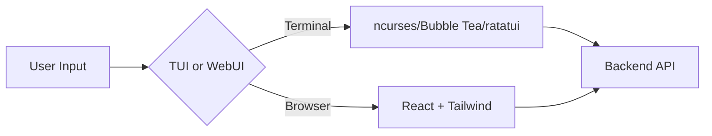

# User Interfaces — Codebase Map

**Source:** https://github.com/cloudbsdorg/application_guidelines/tree/main
**Category:** UI/UX Development Standards

## Overview

The User Interfaces section contains guidelines for building interfaces following the CloudBSD aesthetic and usability standards. There are two types of user interfaces covered: Terminal/TUI and Web UI.

## Documents

### TUI/TUI.md

**Purpose:** Design and implementation guidelines for modern, responsive console-based applications.

**Key Topics:**
- ncurses-based UI development
- Bubble Tea (Go TUI framework)
- ratatui (Rust TUI framework)
- Keyboard navigation (mandatory)
- Color palette and theming
- Responsive layout
- Accessibility requirements
- Internationalization in TUI

**Framework Options:**
| Language | Framework | Notes |
|----------|-----------|-------|
| Go | Bubble Tea | Preferred for Go projects |
| Rust | ratatui | Preferred for Rust projects |
| C/C++ | ncurses | Low-level control |
| Python | npyscreen | Quick TUI prototypes |

**Related Documents:**
- `../core-standards/Internationalization/INTERNATIONALIZATION.md` (i18n)
- `../core-standards/Configuration Files/CONFIGURATION.md` (config)
- `../../SKILLS/ascii-diagrammer.md` (diagram generation)

---

### Web User Interfaces/WEBUI.md

**Purpose:** Guidelines for modern, secure, and accessible web-based frontends.

**Key Topics:**
- React with TypeScript (preferred stack)
- Tailwind CSS for styling
- Accessibility (WCAG 2.1 Level AA)
- Security headers and practices
- Responsive design
- Internationalization (i18next)
- API integration patterns
- State management
- Performance optimization

**Tech Stack Recommendations:**
| Layer | Technology | Notes |
|-------|------------|-------|
| Framework | React 18+ | With TypeScript |
| Styling | Tailwind CSS | Utility-first |
| State | Zustand / Redux Toolkit | Based on complexity |
| i18n | i18next | Required |
| Testing | Jest + React Testing Library | |
| Forms | React Hook Form | Validation |

**Related Documents:**
- `../core-standards/Internationalization/INTERNATIONALIZATION.md` (i18n)
- `../core-standards/Configuration Files/CONFIGURATION.md` (config)
- `../core-standards/Unit Testing/UNITTESTS.md` (testing)

## UI/UX Analysis Skills

For analyzing existing interfaces, these skills are available:

| Skill | Purpose |
|-------|---------|
| `../../SKILLS/ui-ux-analyzer.md` | Document UI objects, states, actions, and data flow |
| `../../SKILLS/api-analyzer.md` | Document REST endpoints and HTTP protocols |
| `../../SKILLS/ascii-diagrammer.md` | Generate architecture diagrams |

## Common Requirements

Both TUI and Web UI must meet these mandatory requirements:

1. **Keyboard Navigation** — All interfaces must be fully keyboard-navigable
2. **Accessibility** — WCAG 2.1 Level AA (web) or equivalent (TUI)
3. **UTF-8 Encoding** — All text must be UTF-8
4. **Internationalization** — User-facing strings must be externalized
5. **Error Handling** — Clear, actionable error messages
6. **Observability** — Configurable log levels

## Selection Matrix

| Use Case | Recommended UI | Primary Language |
|----------|----------------|------------------|
| Server management | TUI | Go (Bubble Tea) or Rust (ratatui) |
| Network monitoring | TUI | Go or C |
| Web applications | Web UI | React + TypeScript |
| Mobile-first apps | Web UI | React |
| CI/CD dashboards | Web UI | React + TypeScript |
| Embedded systems | TUI | C/C++ |

## Mermaid Diagram Standard

All architecture diagrams must use Mermaid syntax:

## Related Skills

- `../../SKILLS/ui-ux-analyzer.md` — UI analysis
- `../../SKILLS/api-analyzer.md` — API analysis
- `../../SKILLS/ascii-diagrammer.md` — Diagrams
- `../../SKILLS/task-workflow.md` — Task management